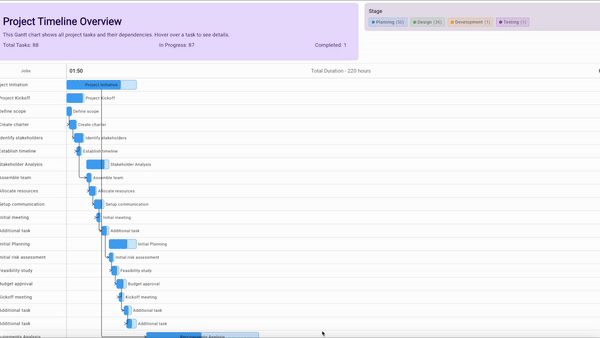

[](https://search.maven.org/search?q=g:%22io.github.kotlinlabs%22%20AND%20a:%22ganttly%22)
# Ganttastic

A modern Gantt chart implementation using Compose Multiplatform, targeting Wasm/JS with Kotlin.

## Features

- Interactive Gantt chart visualization
- Task dependencies with directional arrows
- Collapsible children tasks
- Customizable task colors and progress indicators
- Interactive tooltips with task information

## Demo



## Getting Started

### Installation

#### Gradle (Kotlin DSL)

```kotlin
// In your build.gradle.kts
dependencies {
    implementation("io.github.kotlinlabs:ganttly:$version")
}
```

## Basic Usage
```kotlin
fun main() { 
    CanvasBasedWindow("Ganttastic", canvasElementId = "ganttasticCanvas") {
        val ganttState = remember { createSampleNestedGanttState() }
        val customTheme = ganttTheme {
            naming {
                taskListHeader = "Jobs"
                taskGroups = "Stage"
                noGroupsMessage = "No stages found"
            }
        }

        GanttChartView(
            state = ganttState,
            headerContent = {
                // Optional header content that collapses on scroll
                Column(modifier = Modifier.fillMaxWidth().padding(16.dp)) {
                    Text(
                        "Project Timeline Overview",
                        style = MaterialTheme.typography.headlineMedium,
                        fontWeight = FontWeight.Bold
                    )

                    // Add your custom header content here
                }
            },
            ganttTheme = customTheme
        )
    }
}
```

## Customizing the Theme

```kotlin
val customTheme = ganttTheme {
    colors {
        // Override default colors
        taskBarBackground = { baseColor, isHovered -> 
            if (isHovered) baseColor.copy(alpha = 0.8f) else baseColor.copy(alpha = 0.6f) 
        }
    }
    styles {
        // Customize dimensions and sizes
        taskBarHeight = 0.7f
        taskBarCornerRadius = 0.25f
        dependencyArrowWidth = 1.5.dp
    }
    naming {
        // Change text labels
        taskListHeader = "Activities"
        taskGroups = "Department"
        noGroupsMessage = "No departments assigned"
    }
}
```

## Creating Task Hierarchies
```kotlin
val projectTask = GanttTask.createParentTask(
    id = "project",
    name = "Full Project",
    startDate = now,
    children = listOf(
        // This is a nested parent task
        GanttTask.createParentTask(
            id = "phase1",
            name = "Phase 1",
            startDate = now,
            children = listOf(
                // Child tasks of Phase 1
                GanttTask(
                    id = "task1.1",
                    name = "Task 1.1",
                    startDate = now,
                    duration = 2.hours,
                    progress = 0.5f
                ),
                GanttTask(
                    id = "task1.2",
                    name = "Task 1.2",
                    startDate = now.plus(2.hours),
                    duration = 3.hours,
                    progress = 0.3f
                )
            ),
            progress = 0.4f
        ),
        // Another nested parent task
        GanttTask.createParentTask(
            id = "phase2",
            name = "Phase 2",
            startDate = now.plus(5.hours),
            children = listOf(
                // Child tasks of Phase 2
                GanttTask(
                    id = "task2.1",
                    name = "Task 2.1",
                    startDate = now.plus(5.hours),
                    duration = 4.hours,
                    progress = 0.0f
                )
            ),
            progress = 0.0f
        )
    ),
    progress = 0.2f
)

```

## Platform Support
- Web (Wasm/JS)
- Android (planned)
- Desktop (planned)
- iOS (planned)

## Architecture
Ganttastic is built with:
- Kotlin Multiplatform
- Compose Multiplatform
- Kotlinx.datetime for cross-platform date handling

## Contributing
Contributions are welcome! Please feel free to submit a Pull Request.
1. Fork the repository
2. Create your feature branch (`git checkout -b feature/amazing-feature`)
3. Commit your changes (`git commit -m 'Add some amazing feature'`)
4. Push to the branch (`git push origin feature/amazing-feature`)
5. Open a Pull Request

Please make sure to update tests as appropriate and adhere to the existing coding style.
## License
This project is licensed under the MIT License - see the [LICENSE](LICENSE) file for details.
## Acknowledgments
- Developed pairing with Jetbrains IntelliJ IDEA - Community Edition [AI Assistance](https://www.jetbrains.com/ai-assistant/)

## Roadmap
- [x] Publish library
- [x] Implement hierarchical tasks with smooth animations
- [x] Add collapsible project header
- [ ] Add cool animations.
- [ ] Implement critical path calculation
- [ ] Dark mode support

## Contact
Project Link: [https://github.com/kotlinlabs/ganttastic](https://github.com/kotlinlabs/ganttastic)