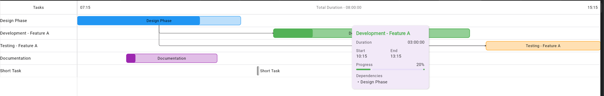

# Ganttastic

A modern Gantt chart implementation using Compose Multiplatform, targeting Wasm/JS with Kotlin.

## Features

- Interactive Gantt chart visualization
- Task dependencies with directional arrows
- Customizable task colors and progress indicators
- Interactive tooltips with task information

## Demo



## Getting Started

### Installation

#### Gradle (Kotlin DSL)

```kotlin
// In your build.gradle.kts
dependencies {
    implementation("com.karthyks:ganttastic:1.0.0")
}
```

```groovy
// In your build.gradle
dependencies {
    implementation 'com.karthyks:ganttastic:1.0.0'
}
```
## Basic Usage
```kotlin
// Create tasks
val tasks = listOf(
    Task(
        id = "task1",
        name = "Research",
        startDate = LocalDate.parse("2023-05-01"),
        endDate = LocalDate.parse("2023-05-10"),
        progress = 0.8f,
        color = Color.Blue
    ),
    Task(
        id = "task2",
        name = "Design",
        startDate = LocalDate.parse("2023-05-11"),
        endDate = LocalDate.parse("2023-05-20"),
        progress = 0.5f,
        color = Color.Green
    ),
    Task(
        id = "task3",
        name = "Implementation",
        startDate = LocalDate.parse("2023-05-21"),
        endDate = LocalDate.parse("2023-06-10"),
        progress = 0.2f,
        color = Color.Red
    )
)

// Define dependencies between tasks
val dependencies = listOf(
    Dependency(fromTaskId = "task1", toTaskId = "task2"),
    Dependency(fromTaskId = "task2", toTaskId = "task3")
)

// Render the Gantt chart
GanttChart(
    tasks = tasks,
    dependencies = dependencies,
    onTaskClick = { task -> 
        println("Task clicked: ${task.name}")
    }
)
```
## Platform Support
- Web (Wasm/JS)
- Android (planned)
- Desktop (planned)
- iOS (planned)

## Architecture
Ganttastic is built with:
- Kotlin Multiplatform
- Compose Multiplatform
- Kotlinx.datetime for cross-platform date handling

## Contributing
Contributions are welcome! Please feel free to submit a Pull Request.
1. Fork the repository
2. Create your feature branch (`git checkout -b feature/amazing-feature`)
3. Commit your changes (`git commit -m 'Add some amazing feature'`)
4. Push to the branch (`git push origin feature/amazing-feature`)
5. Open a Pull Request

Please make sure to update tests as appropriate and adhere to the existing coding style.
## License
This project is licensed under the MIT License - see the [LICENSE](LICENSE) file for details.
## Acknowledgments
- Developed pairing with Jetbrains [Junie](https://www.jetbrains.com/junie/)

## Roadmap
- [x] Publish library
- [ ] Implement critical path calculation
- [ ] Add timeline zoom
- [ ] Support for recurring tasks
- [ ] Dark mode support

## Contact
Project Link: [https://github.com/karthyks/ganttastic](https://github.com/karthyks/ganttastic)
